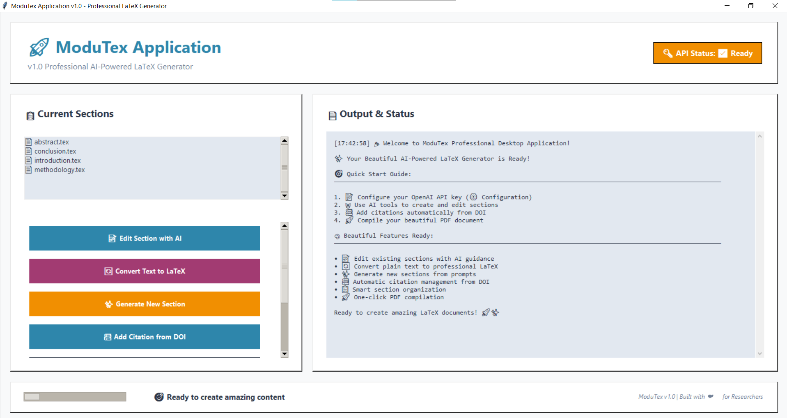

# 🎨 ModuTex Desktop Application v1.0
*Professional AI-Powered LaTeX Document Generator*

[](https://choosealicense.com/licenses/mit/)
[](https://github.com/ModuTex/ModuTex)
[](https://openai.com/)
[](https://www.microsoft.com/windows)



## 🎉 **Welcome to ModuTex - The Most Beautiful LaTeX Application!**

ModuTex is a professional desktop application that transforms LaTeX writing into a visual, intuitive experience powered by artificial intelligence. Create beautiful academic documents, research papers, and technical reports with ease!

---

## 🚀 **Quick Start Guide (5 Minutes Setup)**

### **Step 1: Install Dependencies**
Run the automatic setup (right-click → "Run as administrator"):
```cmd
setup.bat
```
*This installs Python, required packages, and creates the environment configuration.*

### **Step 2: Configure Your OpenAI API Key**

#### **Get Your API Key:**
1. Visit [OpenAI API Keys](https://platform.openai.com/api-keys)
2. Sign in to your OpenAI account (create one if needed)
3. Click "Create new secret key"
4. Copy the key (starts with `sk-proj-` or `sk-`)

#### **Set Up Your API Key:**
1. Open the `.env` file in your ModuTex folder (created by setup.bat)
2. Replace `your_openai_api_key_here` with your actual API key:
   ```
   OPENAI_API_KEY=sk-proj-your_actual_api_key_here
   ```
3. Save the file

**Alternative Method via GUI:**
1. Launch ModuTex (see Step 3)
2. Click "⚙️ Configuration"
3. Click "📝 Edit .env File"
4. Add your API key and save

### **Step 3: Launch ModuTex**
Double-click to start your beautiful desktop application:
```cmd
modutex_app.bat
```

**🎉 That's it! Your professional LaTeX generator is ready!**

---

## 🎨 **Application Overview**

### **Beautiful Desktop Interface**
ModuTex features a modern, professional desktop interface with:
- **Visual Operation**: No command line required
- **Real-time Feedback**: Watch AI work with progress indicators
- **Professional Design**: Elegant blue and orange color scheme
- **Responsive Layout**: Beautiful on any screen size

### **Main Interface Layout**
```
╔══════════════════════════════════════════════════════════════════╗
║  🚀 ModuTex Application v1.0                     🔑 API: ✅      ║
║  Professional AI-Powered LaTeX Generator                        ║
╚══════════════════════════════════════════════════════════════════╝

LEFT PANEL                          RIGHT PANEL
┌─ Current Sections ────────┐      ┌─ Live Output & Status ─────────┐
│  📋 Live Section List     │      │  📄 Real-time Messages        │
│  📄 introduction.tex      │      │  [10:30:25] Welcome! 🎉       │
│  📄 methodology.tex       │      │  [10:30:26] API Ready ✅       │
│  📄 results.tex           │      │  [10:30:27] AI Processing...   │
│                            │      │                               │
│  🎯 Action Buttons        │      │  🤖 AI Status Updates         │
│  📝 Edit Section with AI  │      │  [Progress] ████████████      │
│  🔄 Convert Text to LaTeX │      │  ✅ Task Complete!            │
│  ✨ Generate New Section  │      │  📄 PDF Compiled              │
│  📚 Add Citation from DOI │      │  🚀 Ready for Next Task       │
│  📋 Manage Sections       │      │                               │
│  🚀 Compile PDF           │      │                               │
│  ⚙️ Configuration         │      │                               │
└────────────────────────────┘      └───────────────────────────────┘
```

---

## 🎯 **How to Use ModuTex**

### **1. 📝 Edit Existing Section with AI**
**Purpose**: Improve existing LaTeX content with AI assistance
- Click "📝 Edit Section with AI"
- Select the section from dropdown menu
- Describe improvements (e.g., "Add mathematical equations", "Improve academic tone")
- Click "✨ Improve Section"
- Watch AI enhance your content in real-time!

### **2. ✨ Generate New Section**
**Purpose**: Create professional content from scratch
- Click "✨ Generate New Section"
- Enter section name (e.g., "introduction", "methodology", "results")
- Describe what you want in the section
- Click "✨ Generate Section"
- AI creates academic-quality content automatically!

### **3. 🔄 Convert Text to LaTeX**
**Purpose**: Transform plain text to professional LaTeX format
- Click "🔄 Convert Text to LaTeX"
- Paste your plain text content
- Enter target section name
- Click "🔄 Convert to LaTeX"
- AI formats your content with proper LaTeX commands!

### **4. 📚 Add Citation from DOI**
**Purpose**: Automatically fetch and format academic references
- Click "📚 Add Citation from DOI"
- Enter the DOI (e.g., `10.1038/nature12373`)
- Click "📚 Fetch Citation"
- Citation is automatically added to your bibliography!

### **5. 📋 Manage Sections**
**Purpose**: Organize your document structure
- Click "📋 Manage Sections"
- View all sections in your document
- Create empty sections, delete unwanted ones
- Click "🔄 Sync main.tex" to update document structure

### **6. 🚀 Compile PDF**
**Purpose**: Generate beautiful PDF from your LaTeX
- Click "🚀 Compile PDF"
- Watch compilation progress
- PDF opens automatically when ready!

---

## 🎨 **Example Workflows**

### **Creating a Research Paper from Scratch**
```
1. 🚀 Launch ModuTex
   └── Double-click modutex_app.bat

2. ✨ Generate Introduction
   └── Click "Generate New Section"
   └── Name: "introduction"
   └── Description: "Literature review on machine learning in healthcare"
   └── AI creates professional introduction

3. ✨ Add More Sections
   └── Repeat for "methodology", "results", "discussion", "conclusion"

4. 📚 Add References
   └── Click "Add Citation from DOI"
   └── Enter relevant DOIs
   └── Bibliography builds automatically

5. 📝 Refine Content
   └── Click "Edit Section with AI"
   └── Select section and request improvements
   └── "Add more mathematical formulations"

6. 🚀 Generate Final PDF
   └── Click "Compile PDF"
   └── Beautiful academic paper ready!
```

### **Converting Existing Draft to LaTeX**
```
1. 📋 Prepare Your Text
   └── Copy content from Word, notes, etc.

2. 🔄 Convert to LaTeX
   └── Click "Convert Text to LaTeX"
   └── Paste content in text area
   └── Enter section name
   └── AI converts to professional LaTeX

3. ✨ Enhance with AI
   └── Click "Edit Section with AI"
   └── "Improve academic writing style"
   └── "Add proper citations"

4. 🚀 Compile Beautiful PDF
   └── Click "Compile PDF"
   └── Professional document ready!
```

---

## 📁 **Project Structure**

```
LaTexApp/
├── 📱 modutex_app.bat         # MAIN APPLICATION LAUNCHER
├── 🎨 modutex_gui.py          # Beautiful Desktop Interface
├── 🤖 texchat.py              # AI Processing Engine
├── 🔧 setup.bat               # One-click installer
├── 📄 compile.bat             # PDF compilation
├── 📝 main.tex                # Master LaTeX document
├── 🔑 .env                    # API configuration (YOU EDIT THIS)
├── 📖 README.md               # This guide
│
├── 📂 sections/               # LaTeX content sections
│   ├── introduction.tex
│   ├── methodology.tex
│   ├── results.tex
│   └── conclusion.tex
│
├── 📂 bib/                    # Bibliography files
│   ├── references.bib         # Auto-generated citations
│   └── local_manual.bib       # Manual citations
│
├── 📂 figures/                # Images and graphics
│   ├── fig1.png
│   └── fig2.png
│
└── 📂 templates/              # Journal templates
    ├── elsevier/
    └── ieee/
```

---

## ⚙️ **API Configuration Guide**

### **Setting Up Your OpenAI API Key**

#### **Method 1: Edit .env File Directly**
1. Open `.env` file in your ModuTex folder
2. Find the line: `OPENAI_API_KEY=your_openai_api_key_here`
3. Replace with your actual key: `OPENAI_API_KEY=sk-proj-abc123...`
4. Save the file

#### **Method 2: Through ModuTex GUI**
1. Launch ModuTex application
2. Click "⚙️ Configuration" button
3. Click "📝 Edit .env File"
4. Add your API key and save
5. Restart the application

#### **Method 3: Manual File Creation**
If `.env` file doesn't exist:
1. Copy `.env.example` to `.env`
2. Edit `.env` with your API key
3. Save and restart ModuTex

### **API Key Requirements**
- **Format**: Starts with `sk-proj-` or `sk-`
- **Source**: [OpenAI Platform](https://platform.openai.com/api-keys)
- **Cost**: Pay-per-use (very affordable for document creation)
- **Security**: Keep your key private, never share it

### **Model Selection (Optional)**
Add to your `.env` file:
```
# Choose your preferred model
OPENAI_MODEL=gpt-4-turbo     # Recommended (best balance)
# OPENAI_MODEL=gpt-4         # Highest quality (more expensive)
# OPENAI_MODEL=gpt-3.5-turbo # Fastest (cheapest)
```

---

## 🔧 **Troubleshooting**

### **API Issues**

#### **"API Status: ⚙️ Setup Required"**
**Problem**: OpenAI API key not configured
**Solution**:
1. Check your `.env` file exists
2. Verify your API key format (starts with `sk-proj-` or `sk-`)
3. Ensure no extra spaces or quotes around the key
4. Restart ModuTex after editing

#### **"API request failed: 401"**
**Problem**: Invalid API key
**Solution**:
1. Verify your API key is correct
2. Check if key is still active at [OpenAI Platform](https://platform.openai.com/api-keys)
3. Generate a new key if needed
4. Update `.env` file with new key

#### **"Rate limit exceeded"**
**Problem**: Too many requests in short time
**Solution**:
1. Wait 1-2 minutes before trying again
2. Consider upgrading your OpenAI plan
3. Use gpt-3.5-turbo for faster processing

### **Application Issues**

#### **App Won't Start**
**Solution**:
1. Run setup.bat as Administrator
2. Check Python installation: `python --version`
3. Verify all packages installed: `pip list`
4. Check for error messages in command window

#### **PDF Compilation Fails**
**Solution**:
1. Ensure MiKTeX/TeX Live is installed
2. Check for LaTeX syntax errors in sections
3. Run `compile.bat` manually to see detailed errors
4. Install missing LaTeX packages if prompted

#### **Sections Not Appearing**
**Solution**:
1. Check that section files exist in `sections/` folder
2. Click "📋 Manage Sections" → "🔄 Sync main.tex"
3. Ensure section files end with `.tex`
4. Restart application to refresh section list

### **Common Error Messages**

| Error | Cause | Solution |
|-------|-------|----------|
| "API key not configured" | Missing or invalid API key | Set up OpenAI API key in .env |
| "Section file not found" | Section doesn't exist | Create section or check filename |
| "Network error" | Internet connectivity | Check internet connection |
| "LaTeX compilation failed" | Syntax errors in LaTeX | Review LaTeX syntax in sections |
| "Permission denied" | File access issues | Run as Administrator |

---

## 🏆 **Why Choose ModuTex?**

### **Professional Quality**
- ✅ **Beautiful Interface**: Software-grade design
- ✅ **No Learning Curve**: Intuitive point-and-click operation
- ✅ **AI-Powered**: GPT-4 integration for high-quality content
- ✅ **Real-time Feedback**: Always know what's happening
- ✅ **Professional Output**: Publication-ready LaTeX documents

### **Complete Solution**
- ✅ **One-Click Setup**: Everything installed automatically
- ✅ **Visual Operation**: No command line required
- ✅ **AI Content Generation**: Create and improve content automatically
- ✅ **Citation Management**: DOI-based reference handling
- ✅ **PDF Compilation**: Beautiful output with one click
- ✅ **Template Support**: IEEE, Elsevier, and custom templates

### **Perfect For**
- 📊 **Research Papers**: Academic publications and theses
- 📋 **Technical Reports**: Engineering and scientific documentation
- 📚 **Conference Papers**: Submissions for academic conferences
- 💼 **Project Documentation**: Professional project reports
- 🎓 **Educational Materials**: Course notes and presentations

---

## 💡 **Tips for Best Results**

### **Writing Effective Prompts**
- **Be Specific**: "Add mathematical equations for machine learning algorithms"
- **Include Context**: "For a computer science conference paper"
- **Request Examples**: "Include code examples and pseudocode"
- **Specify Style**: "Use formal academic writing tone"

### **Organizing Your Document**
1. **Start with Structure**: Create all main sections first
2. **Generate Content**: Use AI to fill each section
3. **Add Citations**: Include DOIs for automatic formatting
4. **Refine Content**: Use AI editing for improvements
5. **Compile Often**: Check PDF output regularly

### **Citation Management**
- Use DOI whenever possible for automatic citation
- Add manual citations to `bib/local_manual.bib`
- Cite using `\cite{key}` format in your text
- Bibliography is automatically formatted

---

## 🤝 **Support & Community**

### **Getting Help**
- **Configuration Issues**: Use "⚙️ Configuration" in the app
- **LaTeX Questions**: Check LaTeX documentation
- **API Problems**: Visit [OpenAI Help Center](https://help.openai.com/)

### **Useful Resources**
- [LaTeX Documentation](https://www.latex-project.org/help/documentation/)
- [OpenAI API Documentation](https://platform.openai.com/docs)
- [MiKTeX Documentation](https://miktex.org/docs)

---

## 🎉 **Ready to Create Amazing Documents!**

**ModuTex transforms LaTeX writing from complex coding to beautiful visual creation!**

### **Start Creating Now:**
```cmd
# One-time setup (5 minutes)
1. setup.bat              # Install everything
2. Edit .env file         # Add your OpenAI API key
3. modutex_app.bat        # Launch beautiful application

# Then just point, click, and create! 🎉
```

**✨ Experience LaTeX writing like never before - beautiful, intuitive, and powered by AI!**

---

### 🚀 **Quick Reference Commands**
```cmd
modutex_app.bat           # Launch main application
setup.bat                 # Install/reinstall everything
compile.bat               # Compile PDF manually
```

*Built with ❤️ for researchers, students, and professionals who want beautiful documents without the complexity!* "# modutex" 
